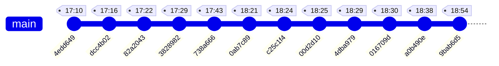

# Gitコミット・修正履歴ログ (2026/06/11)

このファイルは、2026年6月11日に行われた一連のカテゴリ修正作業、その後の試行錯誤（Revert/Reapply）、およびコミット `738a666`（カテゴリ優先順位 修正）の状態への巻き戻し作業の履歴をまとめたものです。

---

## 1. 概要 (Overview)
*   **最終的な目標**: コミット `738a6669cd672318102cb7b521389faff591d0ad` 時点（カテゴリ優先順位 修正）のコード状態に戻すこと。
*   **アプローチ**: 既存のコミット履歴を消去せず（強制プッシュによる歴史の改変を行わず）、最新コミット `9bab6d5` にてファイル全体を `738a666` 時点の内容に上書き・復元する形で `main` ブランチに反映しました。

---

## 2. コミット履歴タイムライン (2026/06/11)

以下は時系列順（古いものから順）に並べたコミットの流れです。



---

## 3. 各コミットの変更内容と流れ

### ① [4edd649] 6/11 index.php修正 (17:10)
*   **変更ファイル**: `kawabata-wp-theme/index.php`
*   **内容**: トップページインデックスの基礎調整。

### ② [dcc4b02] 6/11 サイドバー修正-2 ai使用 (17:16)
*   **変更ファイル**: HTML各ファイル、PHPテンプレート、アプリJSなど（計9ファイル）
*   **内容**: サイドバープロフィールのレイアウトや表記の調整（AI指示による修正）。

### ③ [82a2043] 6/11 当社→私たち 修正 (17:22)
*   **変更ファイル**: `kawabata-wp-theme/page-about.php`
*   **内容**: 表記を「当社」から「私たち」に変更。

### ④ [3828982] 6/11 ハンバーガーメニュー修正 カテゴリ (17:29)
*   **変更ファイル**: ヘッダー、インデックス、固定ページ、シングルページ等（計13ファイル）
*   **内容**: モバイル対応のハンバーガーメニューにおけるカテゴリ周りの修正。

### ⑤ [738a666] 6/11 カテゴリ優先順位 修正 (17:43) 【★目標の状態】
*   **変更ファイル**: `index.html`、`kawabata-wp-theme/functions.php`
*   **内容**: カテゴリの出力や優先順位に関する調整。**（今回復元したかった状態）**

### ⑥ [0ab7c89] 611 カテゴリ修正-2 (18:21)
*   **変更ファイル**: インデックスHTML、アーカイブPHP、関数、JS等（計5ファイル）
*   **内容**: カテゴリ表示の再修正。ここから試行錯誤が始まりました。

### ⑦ [c25c1f4] Revert "611 カテゴリ修正-2" (18:24)
*   ⑥のカテゴリ修正-2を打ち消し。

### ⑧ [00d2d10] Reapply "611 カテゴリ修正-2" (18:25)
*   ⑦の打ち消しを戻し、再度カテゴリ修正-2を適用。

### ⑨ [4dba979] Revert "Reapply "611 カテゴリ修正-2"" (18:29)
*   ⑧を再打ち消し。

### ⑩ [016709d] Reapply "Reapply "611 カテゴリ修正-2"" (18:30)
*   ⑨の打ち消しをさらに再適用（試行錯誤の往復）。

### ⑪ [a0b490e] Revert "6/11 カテゴリ優先順位 修正" (18:38)
*   目標地点であった ⑤（`738a666`）の変更自体を一度打ち消すコミット。

### ⑫ [9bab6d5] Revert codebase to develop-restored state (18:54) 【最新】
*   **変更ファイル**: `index.html`、`archive.php`、`functions.php`、`index.php`、`app.js`
*   **内容**:
    `develop-restored` ブランチ（コミット `738a666` から作成したもの）のコード状態を丸ごと現在の `main` ブランチにコピーしてコミット。
    これによって、⑥〜⑪のすべての修正をなかったことにする（しかし履歴自体は残す）形で、**目標である `738a666` 時点のコード内容へ完全に復旧**させました。

---

## 4. 実行されたGitコマンドの履歴
復元作業時に実行されたコマンドの流れです。

1.  **目標コミットで一時ブランチを作成**:
    ```powershell
    git checkout 738a6669cd672318102cb7b521389faff591d0ad
    git checkout -b develop-restored
    ```
2.  **`main` ブランチに切り替え**:
    ```powershell
    git checkout main
    ```
3.  **一時ブランチの内容で作業ツリーを丸ごと上書き**:
    ```powershell
    git restore --source=develop-restored --worktree --staged .
    ```
4.  **復元用コミットの作成とリモートへの送信**:
    ```powershell
    git commit -m "Revert codebase to develop-restored state"
    git push origin main
    ```
